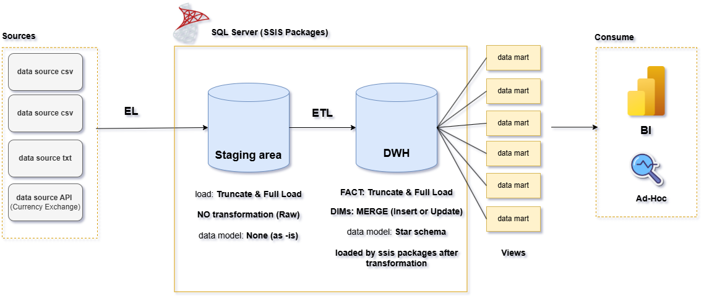
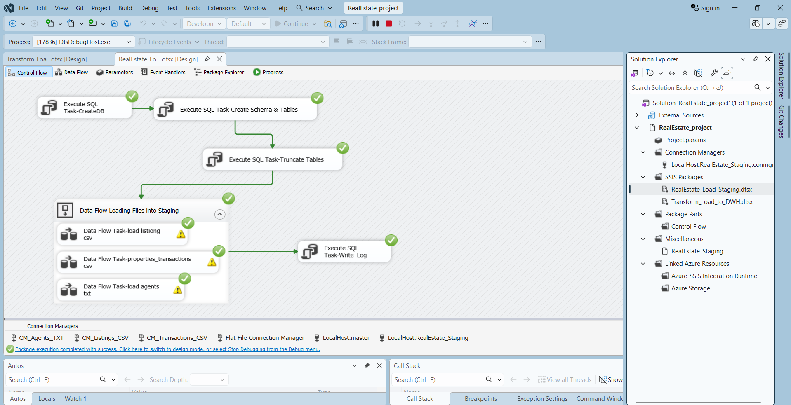
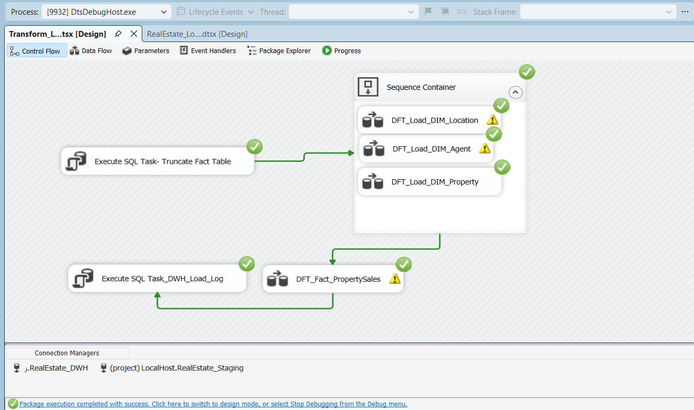

# 🏗️ Real Estate Data Warehouse (End-to-End ETL with SSIS)

An end-to-end Data Warehouse project built using SQL Server and SSIS to transform messy, inconsistent real estate data into a clean, structured, and analysis-ready system.

---
## 📌 Project Overview

This project demonstrates how to design and implement a full ETL pipeline starting from raw data sources to a fully functional Data Warehouse using a Star Schema design.

The goal was to handle real-world dirty data and make it suitable for business intelligence and reporting.

---
## ❗ Challenges

The raw data came from multiple sources and had several issues:

- Negative values in prices  
- Incorrect date formats (YYYY/MM/DD)  
- Typos in property types (e.g., "Apartmnt", "Vlla")  
- Missing values in key columns (city, size)  
- Duplicate records  
- Orphan transactions (no matching properties)  
- Inconsistent values (Y / Yes / 1 / TRUE)

---
## 🛠️ Solution Architecture

### 🔹 1. Staging Layer
- Loaded raw data *as-is* without constraints
- Sources:
  - CSV: Property Listings
  - CSV: Property Transactions
  - TXT: Agents (Pipe-delimited)
  - REST API: Exchange Rates

> Staging ensures no data is rejected and preserves raw input for auditing

---
### 🔹 2. Transformation Layer (SSIS)

Implemented using SSIS components:

- **Conditional Split** → Separate valid and invalid records  
- **Lookup** → Map and generate surrogate keys  
- **Derived Column** → Data cleaning and calculated measures  
- **Data Conversion** → Handle data type inconsistencies  

---

### 🔹 3. Data Warehouse (Star Schema)
Designed using a Star Schema:

#### Dimension Tables:
- `DimProperty`
- `DimAgent`
- `DimDate`
- `DimLocation`

#### Fact Table:
- `FactPropertySales`

- Enforced Foreign Key constraints
- Pre-populated `DimDate` (2020–2026)

---

### 🔹 4. Data Marts (Analytical Views)

Created business-ready views:

- Sales by Location  
- Agent Performance  
- Monthly Trends  
- Buyer Analysis  

---

## ⏰ Automation

- SQL Server Agent Job runs the ETL package daily at 2 AM  
- Fully automated pipeline with no manual intervention  

---

## 📊 Future Enhancements

- Connect to Power BI for interactive dashboards  
- Add slicers (Region / Year / Property Type)  
- Integrate real-time currency conversion API  

---

## 🧠 Key Learnings

- A Data Warehouse is not just storage — it's an architectural decision  
- Staging layer protects the system from dirty data  
- Proper dimension modeling improves query performance and usability  
- ETL pipelines are critical for reliable analytics  

---

## 🛠️ Tech Stack

- SQL Server  
- SSIS (SQL Server Integration Services)  
- T-SQL  
- REST API Integration  

---

## 📸 Screenshots

---
